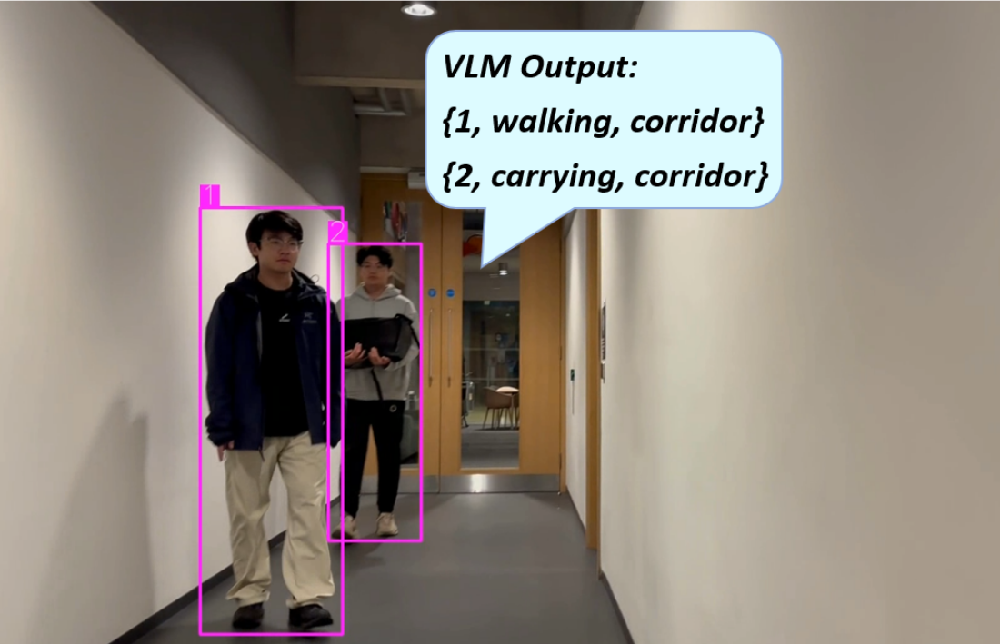

# VISTA: VLM-based Social Robot Navigation

## Overview





VISTA (Visual-Informed Socially Aware Trajectory Agent) is a novel social robot navigation framework that enhances the decision-making ability of robots in dynamic and human-centered environments. Combining Vision-Language Models (VLM) with Deep Reinforcement Learning (DRL), VISTA allows robots to adjust their navigation strategies based on human activities and environmental types.

This repository contains the code for the VISTA framework, including implementation details, model training, and simulation results. The method is validated using simulation experiments in PyBullet and real-world experiments with a TurtleBot3 platform and a RealSense D405 camera.

### Key Features:
- **VLM Integration**: Uses GPT-4o-mini to semantically interpret human activities and scene types.
- **DRL and PPO**: Reinforcement learning-based decision-making combined with Proximal Policy Optimization (PPO).
- **Dynamic Social Navigation**: Robots dynamically adjust their navigation strategies based on the priority of human activities (e.g., walking, carrying, talking) and environmental semantics.
- **Simulation and Real-World Testing**: Tested in both simulated environments and real-world scenarios.

---

## Requirements

- Python 3.7+
- PyBullet for simulation environments
- TensorFlow or PyTorch for model training
- RealSense SDK (for real-world experiments)
- YOLO and DeepSORT (for human detection and tracking in real-time)

---

## Setup
1. In a conda environment or virtual environment with Python 3.6, 3.7, or 3.8
2. Install Pytorch 1.12.1 and torchvision
3. Install OpenAI Baselines:
   ```bash
   git clone https://github.com/openai/baselines.git
   cd baselines
   pip install -e .
   ```
4. Install Python-RVO2 library:
  ```bash
   pip install python-rvo2
  ```


---

## Installation

To get started with VISTA, clone the repository:

```bash
git clone https://github.com/XXINCH-code/VLM_robot_navi.git
cd VLM_robot_navi
```

---

## Acknowledgement

This code partly bases on [HEIGHT]([https://github.com/username/repository](https://github.com/Shuijing725/CrowdNav_HEIGHT.git)). I thank the authors for releasing their code.

